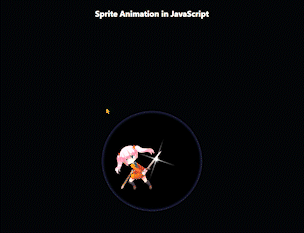

# Anime Sprite Animation

Sprite Animation comes from the classic paper flip animation concept.
In Sprite Animation, two or more images get rendered sequentially in a continuous manner which, in turn, gives an animated single object.

Example:

---

- A sprite sheet consists of multiple frames (also sprites) in one image.

- In other words, sprite sheets pack multiple sprites into a single picture.

- Using sprite sheet, you create sprite sheet animation representing one or - several animation sequences while only loading a single file.

- Sprite sheet animation changes which frame/sprite is rendered in quick succession to give the illusion of movement.

